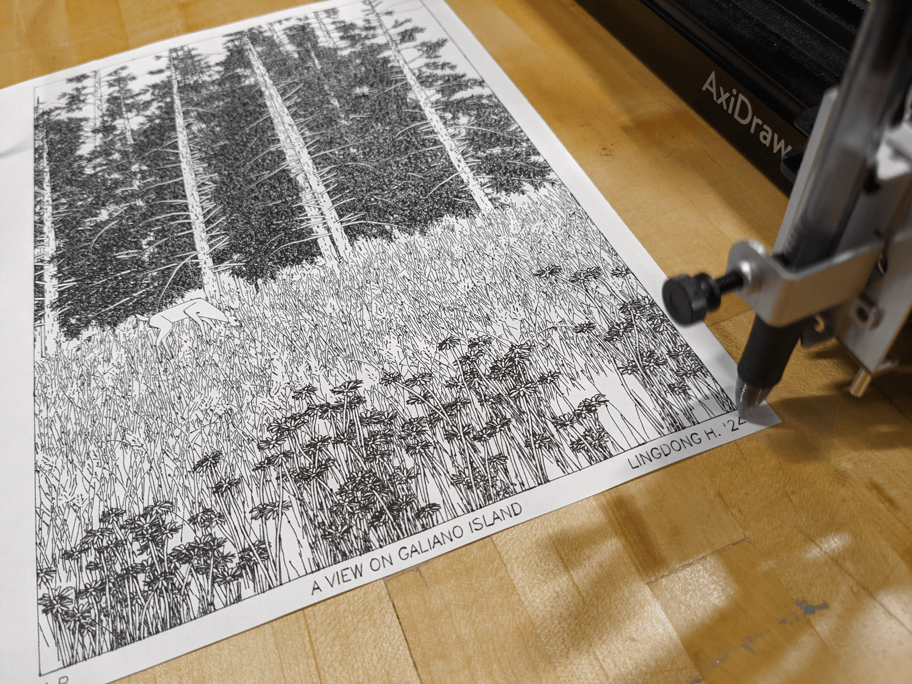
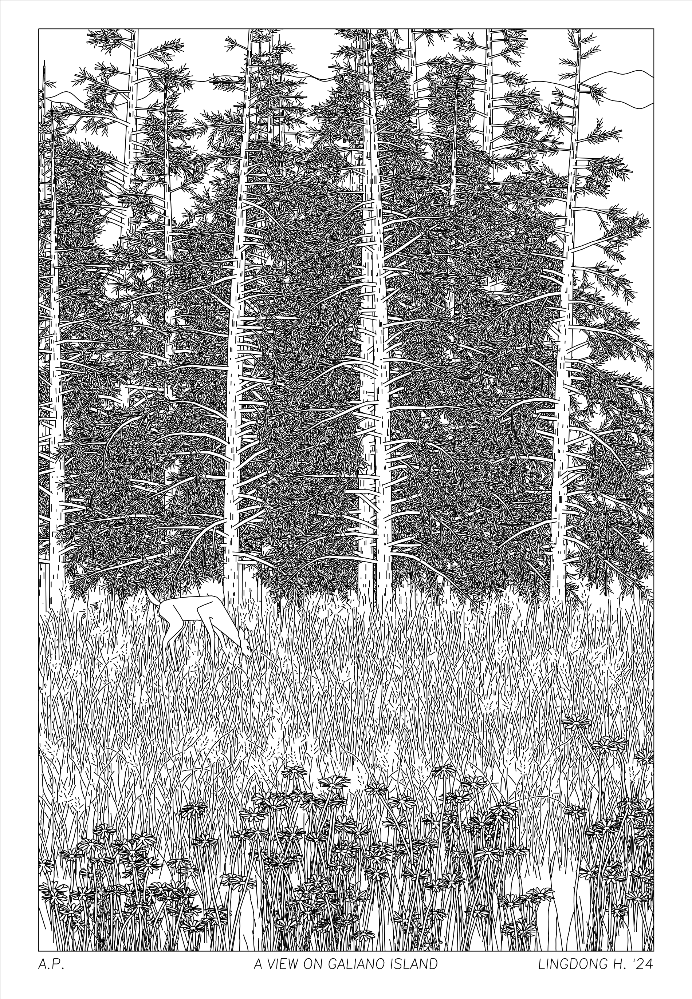
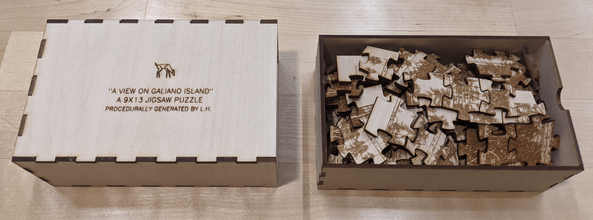

# galiano-drawing



Code for "A View on Galiano Island", a procedurally generated drawing, written in 1 day at [Gradient Retreat](https://www.gradientretreat.com/), Galiano Island, BC, Canada, July 2024.

A raster rendering of the output:



Later made into a jigasw puzzle with a laser cutter:



Code for generating the jigsaw and box shapes are also included.

## Usage

To generate the drawing,

```sh
make drawing
```

To clip the drawing (calculate hidden line removal for plotter):

```sh
make clip
```

It takes about 20-30s to clip all 340K polylines.

To generate the jigsaw puzzle,

```sh
make jigsaw
```

To do all of the above,

```sh
make all
```

Outputs will be placed in the `out/` folder.

